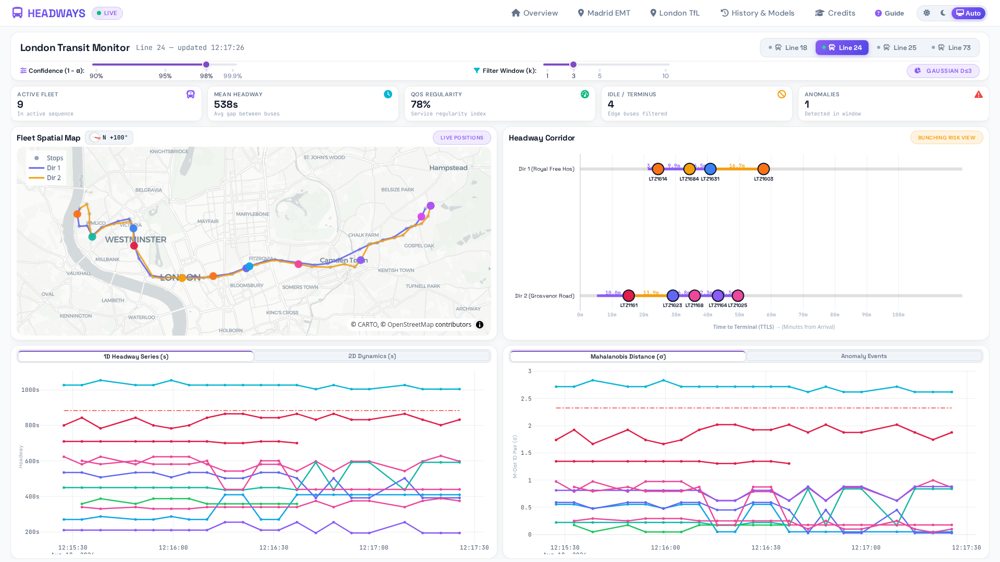
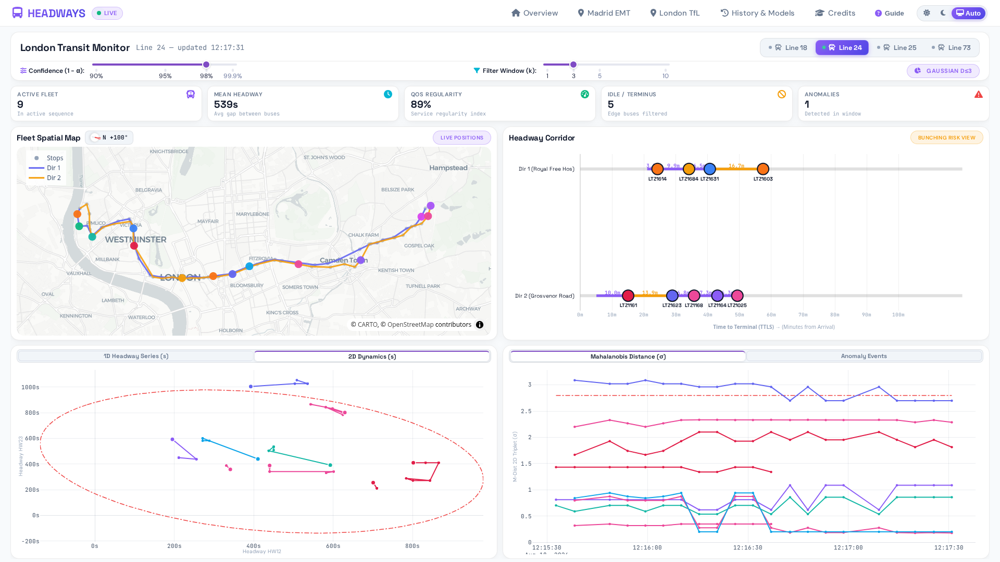
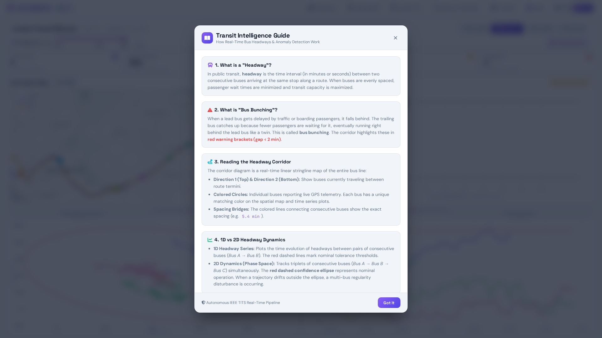
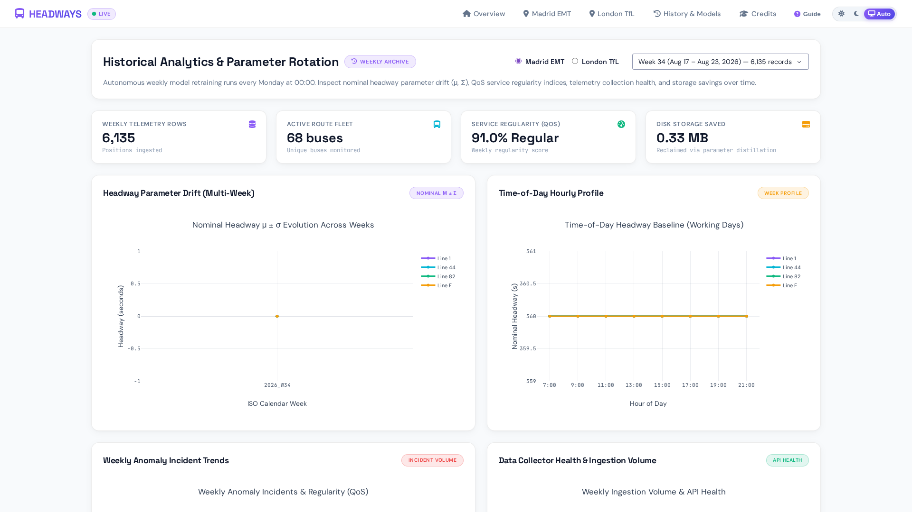

# Bus Headways Analysis & Anomaly Detection

**Real-Time Bus Headway Modeling, Quality of Service (QoS) Estimation, and Autonomous Anomaly Detection for London (TfL) and Madrid (EMT)**

[](https://www.python.org/)
[](https://dash.plotly.com/)
[](https://plotly.com/)
[](https://www.docker.com/)
[](https://www.sqlite.org/)
[](https://doi.org/10.1109/TITS.2022.3155180)
[](https://github.com/astral-sh/ruff)
[](LICENSE)

---

## 📖 Publication & Research

This repository hosts the production implementation and research codebase for the publication:

> **A. Jarabo-Peñas, P. J. Zufiria and C. García-Mauriño**, _"Bus Headways Analysis for Anomaly Detection,"_ in **IEEE Transactions on Intelligent Transportation Systems**, vol. 23, no. 10, pp. 18975-18988, Oct. 2022.
> **DOI:** [10.1109/TITS.2022.3155180](https://doi.org/10.1109/TITS.2022.3155180)

---

## 🖥️ Live Dashboard & Interactive Cockpit

The web application is built with **Dash 4**, **Plotly 6**, and modern glassmorphic styling, engineered as a **100vh desktop cockpit view** (zero scrollbars, 50/50 divided analytics matching the KPI grid, mobile-first responsive scaling, and system-aware dark/light theming).

### 1. Real-Time Fleet Monitor (1D Time Series & Mahalanobis Anomaly Tracking)


_Live monitoring of London Route 24 (Hampstead Heath ↔ Pimlico): Auto-aligned horizontal Fleet Spatial Map with individual vehicle tracking, Linear Stringline Corridor with color-coded bunching warning bridges, 1D Headway Time Series (s) over time, and continuous Mahalanobis Distance anomaly tracking._

---

### 2. Auto-Aligned Route Camera, True North Compass & 2D Phase Space Dynamics


_Route 24 (North-South route): The map camera automatically rotates via Principal Component Analysis (PCA) bearing (`-80.2°`) to align horizontally across the wide screen card, paired with an interactive **True North Compass Widget**. The bottom-left card displays **2D Headway Dynamics trajectories** navigating relative to the $(1-lpha)$ Gaussian confidence ellipse._

---

### 3. Integrated Transit Intelligence Guide (Plain-English Modal)


_Accessible via the `Guide` button in the navbar: An interactive, glassmorphic modal explaining headways, bus bunching, stringline diagrams, 1D/2D dynamics, Mahalanobis distances, and control sliders in intuitive language for non-technical users._

---

### 4. Autonomous Model Retraining & Parameter Rotation Archive (`/history`)


_Inspect nominal parameter drift $(\boldsymbol{\mu}, \boldsymbol{\Sigma})$, QoS service regularity indices, API collection health, and storage savings over historical ISO calendar weeks._

---

## 🏛️ System Architecture

```
┌────────────────────────────────────────────────────────────────────────┐
│                         Live Municipal Transit APIs                    │
│      London TfL Unified API (/Line/{id}/Arrivals)  │  Madrid EMT API   │
└───────────────────┬────────────────────────────────┬───────────────────┘
                    │                                │
                    ▼                                ▼
┌────────────────────────────────────────────────────────────────────────┐
│                   High-Throughput Ingestion Engine                     │
│       scripts/run_london_live.py (5s cycle, <0.8s line-level poll)    │
│       scripts/poll_madrid_access.py (EMT authentication watchdog)      │
└───────────────────┬────────────────────────────────┬───────────────────┘
                    │                                │
                    ▼                                ▼
┌────────────────────────────────────────────────────────────────────────┐
│           Vectorized Processing & Mahalanobis Anomaly Engine           │
│  - Reversed Cumulative TTLS Lookup (times_bt_stops.csv)                │
│  - Edge/Terminal Noise Filtering (first/last 3 stops, dwell <60s)      │
│  - Multi-Dimensional Windowing (d=1, 2, 3)                             │
│  - Vectorized Mahalanobis Distance: D_M = sqrt((x-μ)^T Σ^-1 (x-μ))     │
└───────────────────┬────────────────────────────────┬───────────────────┘
                    │                                │
                    ▼                                ▼
┌────────────────────────────────────────────────────────────────────────┐
│               High-Performance SQLite Storage (core/db.py)             │
│        Data/runtime/transit_telemetry.db (WAL Mode, 64MB Page Cache)   │
│   [buses_burst]   [headways_burst]   [headways_series]   [anomalies]   │
└───────────────────┬────────────────────────────────┬───────────────────┘
                    │                                │
                    ▼                                ▼
┌────────────────────────────────────────────────────────────────────────┐
│                 Modern Dash/Plotly Web Cockpit (:8050)                 │
│   - Auto-Aligned Route Camera with True North Compass Widget           │
│   - Linear Stringline Corridor with Color-Coded Bunching Bridges       │
│   - 1D Headway Series (s)  │  2D Headway Dynamics (s) (Phase Space)    │
│   - Adaptive Mahalanobis Distance (σ)  │  Anomaly Events Table         │
│   - Reactive Sensitivity Sliders (1-α, k) with Zero Layout Overflow    │
│   - Autonomous Weekly Model Retraining Engine (weekly_rotation.py)     │
└────────────────────────────────────────────────────────────────────────┘
```

---

## 🌟 Key Features & Innovations

### 1. Linear Stringline Route Corridor Diagram

Replaced generic scatter charts with a transportation-grade linear route stringline diagram:

- **Dual Direction Rails**: Top track represents Direction 1 (Outbound), bottom track represents Direction 2 (Inbound), with terminus badges.
- **Deterministic 16-Color Vehicle Palette**: Every bus preserves its dedicated color across the Fleet Map, Stringline Corridor, 1D/2D series curves, and Anomaly table.
- **Color-Coded Headway Bridges**:
  - <span style="color: #EF4444; font-weight: bold;">⚠️ Bus Bunching Risk</span> ($< 2\text{ min}$ / $< 120\text{s}$): Highlighted with warning bridges.
  - <span style="color: #8B5CF6; font-weight: bold;">✅ Regular Service</span> ($2 - 12\text{ min}$): Highlighted in purple/indigo.
  - <span style="color: #F59E0B; font-weight: bold;">⏳ Service Gap</span> ($> 12\text{ min}$): Highlighted with amber spacing brackets and minute annotations.

### 2. Auto-Aligning Route Camera & True North Compass

- **PCA Auto-Bearing**: Automatically computes the route's principal axis of variance and rotates the camera bearing so North-South and diagonal bus routes span horizontally across wide desktop monitors.
- **True North Compass**: Glassmorphic heading indicator with rotating red pointer needle showing exact deviation from True North.
- **User Pan/Zoom Lock**: Keyed with `uirevision` — user panning and zooming are preserved across the 5-second live telemetry refresh cycles.

### 3. Multi-Dimensional Statistical Anomaly Detection

- **1D Headway Time Series**: Tracks consecutive pairs $(B_1 \to B_2)$ over time relative to $(1 - \alpha)$ tolerance bounds.
- **2D Dynamics (Phase Space Trajectories)**: Tracks triplets $(B_1 \to B_2 \to B_3)$ simultaneously, plotting dynamic trajectories inside the $(1 - \alpha)$ confidence ellipse:
  $$\boldsymbol{\Sigma} = \begin{bmatrix} \sigma_1^2 & \text{cov}_{12} \\ \text{cov}_{12} & \sigma_2^2 \end{bmatrix}, \quad r_{1,2} = \sqrt{\chi^2_2(1-\alpha) \cdot \lambda_{1,2}}$$
- **Adaptive Mahalanobis Series**: The anomaly metric plot on the right adapts to the active tab on the left ($d=1$ vs $d=2$).

### 4. Fully Reactive Controls & Live KPI Counters

- **Confidence ($1-\alpha$) & Filter Window ($k$) Sliders**: Dragging the sliders instantly updates 1D threshold lines, resizes the 2D confidence ellipse, shifts the Mahalanobis cutoff, and re-evaluates the active anomaly count live.
- **Idle / Terminus KPI Counter**: Tracks vehicles sitting at first/last stops or dwelling near depots that are filtered from headway calculations.

---

## 🚀 Quick Start

### Running with Docker Compose (Recommended)

```bash
# Clone the repository
git clone https://github.com/alejp1998/bus-headways-anom-detection.git
cd bus-headways-anom-detection

# Launch the full container stack (Dashboard :8050, London Collector, Madrid Watchdog)
./scripts/compose.sh up --build -d
```

Open **http://localhost:8050** in your browser.

#### Managing Docker Services

```bash
./scripts/compose.sh status            # View container health and status
./scripts/compose.sh logs -f           # Follow live telemetry logs
./scripts/compose.sh restart dashboard # Restart web server
./scripts/compose.sh down              # Stop stack
```

---

### Running Locally (Python 3.11+)

```bash
# 1. Create and activate virtual environment with uv or venv
uv venv --python 3.11 .venv
source .venv/bin/activate

# 2. Install dependencies
uv pip install -r requirements.txt

# 3. Launch live telemetry collector in the background (or run once)
python scripts/run_london_live.py &

# 4. Start the interactive Dash dashboard
python Dashboard/index.py
```

---

## 📓 Research Notebooks & Reproducibility

All research notebooks have been modernized for Python 3.11+ and connect directly to the live SQLite telemetry database (`core/db.py`):

| Notebook                                                                                             | Focus                                                                                | Execution Status |
| ---------------------------------------------------------------------------------------------------- | ------------------------------------------------------------------------------------ | :--------------: |
| [`London/Notebooks/HeadwaysAnalysis.ipynb`](London/Notebooks/HeadwaysAnalysis.ipynb)                 | Headway distribution fitting, 1D/2D dynamics, SOMNet & Hierarchical Clustering       | ✅ 100% Passing  |
| [`London/Notebooks/API_QoS_Estimation.ipynb`](London/Notebooks/API_QoS_Estimation.ipynb)             | Quality of Service (QoS) index derivation & ETA linearity estimation                 | ✅ 100% Passing  |
| [`London/Notebooks/API_CleanedData_Analysis.ipynb`](London/Notebooks/API_CleanedData_Analysis.ipynb) | Raw TfL trajectory cleaning, stop arrival time extraction & inter-stop distributions | ✅ 100% Passing  |
| [`Madrid/Notebooks/HeadwaysAnalysis.ipynb`](Madrid/Notebooks/HeadwaysAnalysis.ipynb)                 | Empirical Madrid EMT headway characterization & Mahalanobis thresholding             | ✅ 100% Passing  |
| [`Madrid/Notebooks/API_QoS_Estimation.ipynb`](Madrid/Notebooks/API_QoS_Estimation.ipynb)             | Madrid EMT QoS service regularity index formulation                                  | ✅ 100% Passing  |
| [`Madrid/Notebooks/TimeBtStops.ipynb`](Madrid/Notebooks/TimeBtStops.ipynb)                           | Travel time distribution modeling and Value-at-Risk (VaR) fitting                    | ✅ 100% Passing  |

---

## 🛡️ Code Quality & Testing Gates

The repository strictly enforces automated quality gates:

```bash
# Run Ruff linting and formatting
ruff check . && ruff format .

# Run pre-commit hooks (Prettier, JSON/YAML validation, EOF, trailing whitespace)
pre-commit run --all-files

# Run automated test suite
pytest

# Verify Radon cyclomatic complexity (Grades A-C required, 0 D/E/F)
python scripts/check_radon_complexity.py
```

---

## 📚 Citation

```bibtex
@ARTICLE{9733979,
  author={Jarabo-Peñas, Alejandro and Zufiria, Pedro J. and García-Mauriño, Carlos},
  journal={IEEE Transactions on Intelligent Transportation Systems},
  title={Bus Headways Analysis for Anomaly Detection},
  year={2022},
  volume={23},
  number={10},
  pages={18975-18988},
  doi={10.1109/TITS.2022.3155180}
}
```

---

## 📄 License

This project is licensed under the MIT License - see the [LICENSE](LICENSE) file for details.
